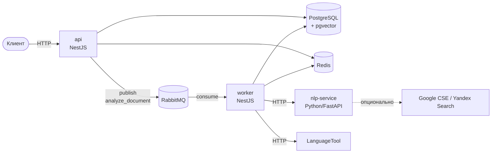

# Antiplagiat

Сервис проверки текстовых документов (PDF, DOCX, TXT) на оригинальность:
точные и перефразированные текстовые заимствования, признаки
ИИ-генерации, грамматические и орфографические ошибки, читаемость и
стилистику, заспамленность, попытки обмана системы антиплагиата и
подозрительные метаданные файла. Всё разворачивается одной командой
`docker compose up -d --build`.

## Содержание

- [Архитектура](#архитектура)
- [Быстрый старт](#быстрый-старт)
- [Переменные окружения](#переменные-окружения)
- [API](#api)
- [Как устроена проверка](#как-устроена-проверка)
- [Формат ошибок](#формат-ошибок)
- [Модель данных](#модель-данных)
- [Расширение без изменения кода](#расширение-без-изменения-кода)
- [Разработка](#разработка)

## Архитектура



Три сервиса, все решения по составу — фиксированы:

| Сервис | Стек | Роль |
|---|---|---|
| `api` | NestJS (HTTP) | приём документов, лёгкие синхронные метрики (раздел 3.1), CRUD настроек, отдача результатов |
| `worker` | NestJS (тот же код, отдельная точка входа `main-worker.ts`, микросервис на RabbitMQ) | весь тяжёлый асинхронный анализ (плагиат, ИИ-детектор, грамматика и т.д.) |
| `nlp-service` | Python/FastAPI | лемматизация (pymorphy3), эмбеддинги предложений (sentence-transformers), OCR (pytesseract), опционально — перплексия |

Инфраструктура: **PostgreSQL + pgvector** (документы, результаты, эмбеддинги
предложений для поиска перефразирования), **Redis** (LSH-бакеты для быстрого
поиска кандидатов на точное совпадение), **RabbitMQ** (очередь задач анализа,
с DLQ и повторами), **LanguageTool** (self-hosted, образ `erikvl87/languagetool`).

`api` и `worker` — одна и та же кодовая база (`server/`), собираются одним
Docker-образом с двумя целями (`target: api` / `target: worker`) и разными
командами запуска.

## Быстрый старт

```bash
cp .env.example .env
docker compose up -d --build
```

После запуска (первый раз — несколько минут: сборка nlp-service тянет
модель эмбеддингов и torch):

- Swagger UI: http://localhost:3000/api/docs
- RabbitMQ Management: http://localhost:15672 (логин/пароль — `RABBITMQ_USER`/`RABBITMQ_PASSWORD` из `.env`)

Проверить, что всё поднялось:

```bash
docker compose ps          # все сервисы должны быть healthy
curl http://localhost:3000/health
```

Загрузить документ на проверку:

```bash
curl -X POST http://localhost:3000/api/documents \
  -F "file=@document.pdf" \
  -F "authorEmail=student@example.com"
```

Ответ содержит `id` документа и статус `PENDING`. Дальше:

```bash
curl http://localhost:3000/api/documents/<id>              # статус + сводные метрики
curl http://localhost:3000/api/documents/<id>/details       # полная разбивка по всем проверкам
```

или подписаться на Server-Sent Events вместо поллинга:

```bash
curl -N http://localhost:3000/api/documents/<id>/stream
```

## Переменные окружения

Полный список с комментариями — в [`.env.example`](.env.example). Ключевые группы:

| Группа | Переменные | Назначение |
|---|---|---|
| API | `API_PORT`, `MAX_FILE_SIZE_MB`, `DEFAULT_PAGE_NORM_CHARS` | лимиты загрузки, стартовый норматив страницы (дальше редактируется через `GET/PUT /api/config/page-norm`) |
| Плагиат | `SHINGLE_SIZE`, `PARAPHRASE_SIMILARITY_THRESHOLD` | размер окна шингла (слов) и порог косинусной близости эмбеддингов для перефразирования |
| Стилистика | `SPAM_TOP_N_WORDS` | сколько самых частых значимых слов учитывать в заспамленности |
| ИИ-детектор | `AI_VERDICT_THRESHOLD` | порог `aiProbability`, с которого выставляется `aiVerdict=true`; веса фич — в БД (`/api/config/weights`) |
| nlp-service | `EMBEDDING_MODEL_NAME`, `ENABLE_PERPLEXITY_FEATURE` | модель эмбеддингов; тяжёлая опциональная фича перплексии (по умолчанию выключена) |
| OCR | `ENABLE_OCR`, `OCR_LANGUAGES` | распознавание сканированных PDF без текстового слоя |
| Внешний поиск | `ENABLE_EXTERNAL_SEARCH`, `EXTERNAL_SEARCH_PROVIDER`, `EXTERNAL_SEARCH_SAMPLE_SIZE`, `GOOGLE_CSE_*`, `YANDEX_SEARCH_*` | опциональная проверка "редких" (не найденных в корпусе) фрагментов через интернет-поиск |
| Rate limiting | `THROTTLE_TTL_SECONDS`, `THROTTLE_LIMIT` | `@nestjs/throttler`, глобальный guard |

Инфраструктурные переменные (`DATABASE_URL`, `REDIS_URL`, `RABBITMQ_URL`,
`LANGUAGETOOL_URL`, `NLP_SERVICE_URL` и учётные данные соответствующих
контейнеров) обычно трогать не нужно — значения по умолчанию рассчитаны на
запуск через `docker-compose.yml` из этого репозитория.

## API

Полная интерактивная документация — Swagger UI на `/api/docs` (все описания
на русском). Кратко:

| Метод | Путь | Назначение |
|---|---|---|
| `POST` | `/api/documents` | загрузить документ на проверку (PDF/DOCX/TXT, опционально `authorEmail`) |
| `GET` | `/api/documents/:id` | статус и сводные метрики (`AnalysisResult`) |
| `GET` | `/api/documents/:id/details` | полная разбивка по всем проверкам, найденные попытки обмана, метаданные файла |
| `GET` | `/api/documents/:id/stream` | тот же статус, но как поток Server-Sent Events (альтернатива поллингу) |
| `POST` | `/api/corpus` | добавить документ в эталонный корпус, с которым сверяются загруженные работы |
| `GET`/`PUT` | `/api/config/page-norm` | норматив символов на одну "страницу" |
| `GET`/`PUT` | `/api/config/weights` | веса фич ИИ-детектора |
| `GET`/`POST`/`DELETE` | `/api/config/junk-words` | словарь мусорных слов/филлеров |

## Как устроена проверка

Каждая стадия анализа независима и пишет свой раздел в
`AnalysisResult.detailsJson` (полностью — через `GET /api/documents/:id/details`),
не затирая результаты остальных стадий.

**3.1 Базовые метрики** — считаются синхронно при загрузке (без очереди):
количество символов/слов/предложений/абзацев, число страниц (символы без
пробелов ÷ норматив страницы), средняя длина предложения, время чтения
(200 слов/мин), язык и его доля по абзацам (`franc`).

**3.2 Заимствования** — три независимых способа, каждый со своим процентом:
- *Точное дублирование* (`plagiarismPct`) — текст режется на шинглы
  (скользящее окно из `SHINGLE_SIZE` слов), для каждого окна шинглов
  строится MinHash-сигнатура и через LSH-индекс в Redis отбираются
  документы-кандидаты корпуса, после чего точное совпадение хешей
  шинглов проверяется в Postgres. Шингл-чанкинг (окна перекрываются)
  нужен, чтобы скопированный один абзац не терялся на фоне остального
  оригинального текста документа.
- *Перефразирование* (`paraphrasePct`) — эмбеддинги предложений
  (`paraphrase-multilingual-MiniLM-L12-v2`, nlp-service) сравниваются с
  эмбеддингами предложений корпуса через косинусную близость в pgvector;
  совпадение выше `PARAPHRASE_SIMILARITY_THRESHOLD` считается пересказом
  чужой мысли своими словами.
- *Самоплагиат* (`selfPlagiarismPct`) — включается автоматически, если при
  загрузке указан `authorEmail`: та же техника шинглов, но сравнение идёт
  не с корпусом, а с предыдущими документами этого же автора.
- *Внешняя проверка по интернету* (`detailsJson.externalSearch`, раздел 3.2) —
  полностью опциональная и выключенная по умолчанию (`ENABLE_EXTERNAL_SEARCH=false`):
  шинглы, не найденные в локальном корпусе, частично проверяются через
  Google Custom Search или Yandex Search API. Это справочная информация
  для человека, она не входит в формулу `originalityPct`.

Доля текста, оформленного как цитата (`citedPct`) считается отдельно —
по доле символов внутри кавычек («...» и "...") — и не вычитается из
оригинальности, как и задумано полем.

`originalityPct = 100 − plagiarismPct − paraphrasePct − selfPlagiarismPct`
(пересчитывается заново каждой из трёх стадий).

**3.3 Детектор ИИ-сгенерированного текста** (`aiProbability`, `aiVerdict`) —
взвешенная сумма независимых эвристик, каждая нормализована к `[0, 1]`:

| Фича | Идея |
|---|---|
| `lexicalDiversity` | низкое отношение уникальных слов к общему числу слов (TTR) — шаблонный текст чаще повторяется |
| `burstiness` | у человека длина предложений "рваная", у ИИ — более ровная (низкий коэффициент вариации → выше признак ИИ) |
| `personalPronouns` | доля личных местоимений заметно ниже ожидаемой для живого авторского текста |
| `aiCliches` | совпадения со словарём типичных ИИ-оборотов (`ClicheWord`, категория `AI_CLICHE`) |
| `synonymChains` | цепочки из 3+ однородных слов через запятую — приём "нанизывания" эпитетов |
| `perplexity` | *опционально* (`ENABLE_PERPLEXITY_FEATURE`), через языковую модель в nlp-service; низкая перплексия (текст легко предсказуем) — признак ИИ |

Веса и список включённых фич — в таблице `DetectorWeight` (БД), не в коде;
редактируются через `GET/PUT /api/config/weights`. Фича, вернувшая `NaN`
(например, выключенная перплексия), исключается из суммы вместе со своим
весом — не искажает результат остальных.

**3.4 Грамматика** (`grammarErrors`) — весь текст документа целиком
отправляется в self-hosted LanguageTool с `language=auto` (документ может
быть смешанным по языку, LanguageTool сам определяет его через fastText).

**3.5 Стилистика и читаемость** (`readabilityScore` + раздел `style` в деталях) —
адаптация формулы Флеша-Кинкейда для русского (И. В. Оборнева), доля
длинных предложений (> 25 слов), доля предложений со страдательным залогом
(эвристика по глагольным окончаниям), канцелярит (словарь `ClicheWord`,
категория `BUREAUCRATIC`), повторы значимых слов в соседних предложениях.

**3.6 Заспамленность** (`spamPct`, `junkWordsPct`) — доля топ-N (`SPAM_TOP_N_WORDS`)
самых частых значимых слов от объёма текста плюс доля слов из
редактируемого словаря мусорных слов/филлеров (`JunkWord`).

**3.7 Попытки обмана системы** (`tamperingFlags`) — выполняется синхронно
при загрузке, до постановки в очередь:
- `HOMOGLYPH` — подмена букв визуально похожими символами другого алфавита
  (кириллица↔латиница, например «а»→«a»). Определяется преобладающий
  алфавит документа и ищутся "точечные" подмены внутри слов, которые в
  остальном на родном алфавите — так не путается с обычными иноязычными
  заимствованиями (слово целиком на другом алфавите не флагуется).
- `ZERO_WIDTH` — невидимые управляющие символы (zero-width space, мягкий
  перенос и т.п.), которыми можно "разорвать" слова для текстового анализа.
- `HIDDEN_TEXT` / `TINY_FONT` — только для DOCX: текст с `w:vanish` или
  белым цветом шрифта, аномально мелкий кегль (< 6pt) — типичные приёмы
  "спрятать" текст от проверки, но не от человека.

**3.8 Метаданные документа** (`metadata`) — дата создания/изменения, автор,
ПО-производитель (из `docProps/core.xml`+`app.xml` для DOCX, из info-словаря
для PDF). Помечается подозрительным, если дата изменения раньше даты
создания, либо документ "изменён" за пару минут до загрузки при том, что
создан на месяц и более раньше — похоже на давно готовый файл, просто
открытый и сразу сданный.

**3.9 OCR** — если в PDF почти нет извлекаемого текстового слоя (скан),
страницы рендерятся в изображения и распознаются Tesseract (`OCR_LANGUAGES`,
по умолчанию `rus+eng`) через nlp-service; результат идёт в пайплайн как
обычный текст документа. Отключается через `ENABLE_OCR=false`.

## Формат ошибок

Любая ошибка API возвращается в едином конверте (глобальный
`HttpExceptionFilter`):

```json
{
  "success": false,
  "errorCode": "DOCUMENT_NOT_FOUND",
  "message": "Документ с указанным ID не найден",
  "statusCode": 404,
  "timestamp": "2026-09-15T05:00:00.000Z",
  "path": "/api/documents/abc123",
  "details": { "id": "abc123" }
}
```

| `errorCode` | HTTP | Когда |
|---|---|---|
| `VALIDATION_ERROR` | 422 | ошибка валидации входных данных (`class-validator`) |
| `UNSUPPORTED_FILE_TYPE` | 415 | тип файла не PDF/DOCX/TXT (проверяется по сигнатуре байт, не по расширению) |
| `FILE_TOO_LARGE` | 413 | файл больше `MAX_FILE_SIZE_MB` |
| `DOCUMENT_NOT_FOUND` | 404 | документ с указанным ID не найден |
| `ANALYSIS_IN_PROGRESS` | 409 | анализ ещё выполняется |
| `ANALYSIS_FAILED` | 500 | пайплайн анализа упал на одной из стадий |
| `NLP_SERVICE_UNAVAILABLE` | 503 | nlp-service недоступен |
| `RATE_LIMITED` | 429 | превышен лимит запросов (`@nestjs/throttler`) |

## Модель данных

Полная схема — [`server/prisma/schema.prisma`](server/prisma/schema.prisma).
Основные модели: `Document` (загруженный документ + базовые метрики),
`AnalysisResult` (сводные проценты + `detailsJson` с полной разбивкой),
`Shingle`/`CorpusShingle` и `SentenceEmbedding`/`CorpusSentenceEmbedding`
(пользовательские документы и эталонный корпус — параллельные, но
независимые наборы таблиц), `TamperingFlag`, `DocumentMetadata`,
`DetectorWeight`, `JunkWord`, `ClicheWord`, `SystemConfig`.

## Расширение без изменения кода

Система спроектирована так, чтобы менять пороги и словари без пересборки:

- **Норматив страницы** — `PUT /api/config/page-norm`.
- **Веса ИИ-детектора** — `PUT /api/config/weights` (тело: массив
  `{ feature, weight, enabled }`). Чтобы выключить фичу — `enabled: false`,
  не удалять строку.
- **Мусорные слова** — `POST`/`DELETE /api/config/junk-words`.
- **Канцелярит и типичные ИИ-обороты** — таблица `ClicheWord` (поле
  `category`: `BUREAUCRATIC` или `AI_CLICHE`); отдельного API нет,
  редактируется напрямую в БД (`INSERT`/`DELETE` в `ClicheWord`).
- **Новая фича ИИ-детектора** — реализовать интерфейс `AiFeatureScorer`
  (`server/src/ai-detector/feature.interface.ts`, метод
  `score(text, context): number | Promise<number>`, `0..1`, `NaN` —
  фича недоступна для этого документа), добавить провайдер в
  `AI_FEATURE_SCORERS` (`ai-detector.module.ts`) и строку веса в
  `DetectorWeight` (через seed или `PUT /api/config/weights`) — оркестратор
  подхватит её автоматически, без изменений в `AiDetectorService`.
- **Новый провайдер внешнего поиска** — реализовать интерфейс
  `ExternalSearchProvider` (`server/src/external-search/`) и добавить
  случай в `external-search-provider.factory.ts`.

Стартовые значения всех словарей и весов заполняются один раз при первом
запуске (`DictionarySeedService`, идемпотентно — не трогает уже
отредактированные данные).

## Разработка

```bash
cd server
npm install
npm run start:api:dev      # api с watch-режимом
npm run start:worker:dev   # worker с watch-режимом (отдельный процесс)
npm run lint
npx prisma migrate dev     # новая миграция при изменении schema.prisma
```

`nlp-service` разрабатывается как обычное FastAPI-приложение:

```bash
cd nlp-service
pip install -r requirements.txt
uvicorn app.main:app --reload --port 8001
```

Инфраструктурные зависимости (Postgres, Redis, RabbitMQ, LanguageTool)
для локальной разработки удобно поднять из `docker-compose.yml`, оставив
`api`/`worker`/`nlp-service` работать вне контейнеров:

```bash
docker compose up -d postgres redis rabbitmq languagetool
```
